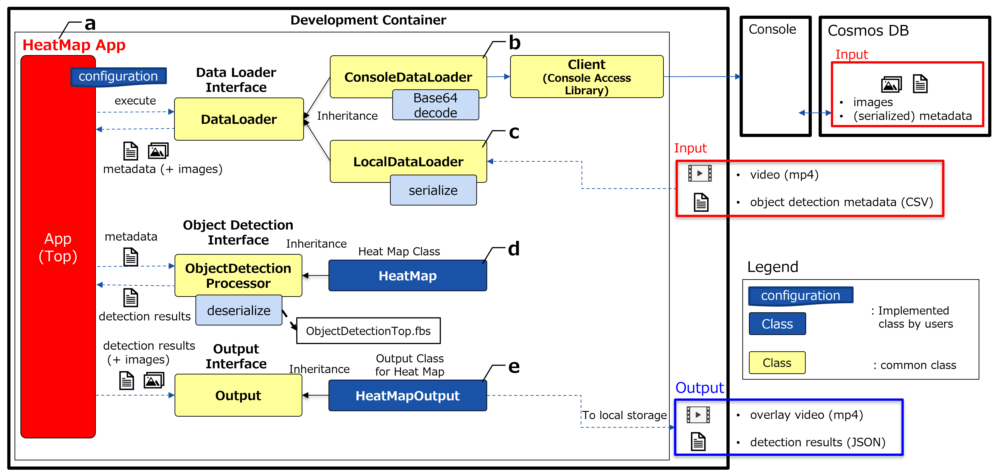

# Heat Map: Sample Application on AITRIOS

## Contents
- [Overview](#overview)
- [Get started](#getting-started)
- [Tutorial](#tutorial)
- [Specifications](#specifications)
  - [Algorithm and parameters](#algorithm-and-parameters)
  - [Design diagram](#design-diagram)
- [Tips](#tips)
- [Get support](#get-support)
- [See also](#see-also)
- [Trademark](#trademark)
- [Notice](#notice)


## Overview

This repository provides sample code for heatmap application using [Cloud SDK for Python](https://github.com/SonySemiconductorSolutions/aitrios-sdk-console-access-lib-python), as well as configuration files for building a development environment. This application retrieves Human detection model metadata from Console and determines where people were concentrated.


### Restrictions

None


## Get started

### Build an environment and get started with the demo application

1. Clone or fork this application in your GitHub environment.
2. Click the `+` button to create a codespace on the GitHub environment. See [how to create a codespace](https://docs.github.com/en/codespaces/developing-in-codespaces/creating-a-codespace-for-a-repository).
> **Note**
> Please select a machine type with 16 cores and 32GB of RAM for smmoth operation of the application.
3. Run the demo application using the following command
    ```
    python src/heat_map_app.py
    ```
4. (Optional) Run the demo application with a custom configuration using the following command
    ```
    python src/heat_map_app.py --config_path /path/to/yaml
    ```

The overlay video and count values of each grid in the heatmap for each frame can be obtained in JSON format using this application.

## Tutorial

### 1. Prepare your device to run inference

To run this application using data inferred from an actual device, it is necessary to set up the device first.

#### Step 1-1: Setup the inference device

Before running this application, you need to complete account setup, environment setup, AI model preparation, and device deployment.

See [Development guides Get started](https://developer.aitrios.sony-semicon.com/development-guides/get-started) for details.

> **Note**
> You need to import a Human Detection AI model created with Custom Vision and corresponding PPL.

#### Step 1-2: Set the Command Parameter file

The Command Parameter file must be set appropriately. Here is an example of parameter settings:

```
{
    "commands" : [
        {
            "command_name":"StartUploadInferenceData",
            "parameters": {
                "Mode": 1,
                "NumberOfImages": 0,
                "UploadInterval": 100,
                "ModelId": "SampleApp-HumanDetection",
                "PPLParameter": {
                    "header": {
                        "id": "00",
                        "version": "01.01.00"
                    },
                    "dnn_output_detections" : 64,
                    "max_detections" : 5,
                    "threshold" : 0.1,
                    "input_width" : 320,
                    "input_height" : 320 
                }
            }
        }
    ]
}
```

#### Step 1-3: Start inference and confirm data acquisition

When the device and parameters are ready, turn on the `Get Inference Data` toggle in Console to start inference. Since `NumberOfImages` is 0, data will continue to be captured until the button is pressed again. After that, check whether the data has been acquired with `Check data` on Console.

See Console User Manual for details.

### 2. Set configuration parameters to start the sample application

There are several configuration files that need to be set up properly for this application to work. Here, you will learn how to set those parameters step by step.

#### Step 2-1: Choose input data

This application can input data not only from Console for AITRIOS but also from local sources. You have to edit the `data_source_settings` section in [config\heat_map_app.yaml](./config/heat_map_app.yaml) in the codespace or the environment where the repository was cloned. Here, we will explain 4 input patterns. If you do not use image data, the overlay video will not be included in the output data.

##### Case 1: Use images and metadata from Console

First, the `mode` parameter must be set to `"console"` to get data from Console. You also need to set the `sub_directory_name` parameter to the directory name that contains the target images. For that, you may need to actually check the Console screen to see which directory the image you want is in.

The minimum required parameters are as follows.
- `mode`: `"console"`
- `setting_path`: The path to [config/console_access_settings.yaml](./config/console_access_settings.yaml)
- `device_id`: Your Device ID
- `sub_directory_name`: The name of the subdirectory where the target images are stored
- `number_of_images`: The maximum number of images to get

Here is an example.
```
data_source_settings:
  mode: "console"
  console_data_settings:
    setting_path: "./config/console_access_settings.yaml"
    device_id: "__device_id__"
    sub_directory_name: "__sub_directory_name__"
    first_timestamp: "yyyyMMddHHmmssfff"                   # invalid
    last_timestamp: "yyyyMMddHHmmssfff"                    # invalid
    number_of_inference_results: 20                        # invalid
    number_of_images: 20
  local_data_settings:
    video_file: "__path_to_video_file__"                   # invalid
    meta_file: "__path_to_csv_meta_file__"                 # invalid
```

##### Case 2: Use only metadata from Console

> **Note**
> The overlay video will not be output in this case.

The `sub_directory_name` parameter must be set to `""`(empty string) in this case. Also, you can specify a range of metadata to be acquired by the `first_timestamp` and `last_timestamp` parameters..

The minimum required parameters are as follows.

- `mode`: `"console"`
- `setting_path`: The path to [config/console_access_settings.yaml](./config/console_access_settings.yaml)
- `device_id`: Your Device ID
- `sub_directory_name`: `""`
- `first_timestamp`: The earliest timestamp of the target metadata in string format or `""`(empty string)
- `last_timestamp`:  The latest timestamp of the target metadata in string format or `""`(empty string)
- `number_of_inference_results`: The maximum number of metadata to get

`number_of_inference_results` must be set to a value greater than or equal to 1.
Here are the setting values for `first_timestamp` and `last_timestamp`, and the corresponding behaviors.

| `first_timestamp`     | `last_timestamp` | Behavior |
|-----------------------| --- | --- |
| `"yyyyMMddHHmmssfff"` |  `"yyyyMMddHHmmssfff"` | Get up to `number_of_inference_results` counted from the latest metadata from `first_timestamp` to `last_timestamp` |
| `"yyyyMMddHHmmssfff"` | `""` | Get up to `number_of_inference_results` counted from the latest metadata from `first_timestamp` to now |
| `""`                  | `"yyyyMMddHHmmssfff"` | Get up to `number_of_inference_results` counted from the latest metadata before `last_timestamp` |
| `""`                  | `""` | Get up to `number_of_inference_results` from the latest metadata |


Here is an example.
```
data_source_settings:
  mode: "console"
  console_data_settings:
    setting_path: "./config/console_access_settings.yaml"
    device_id: "__device_id__"
    sub_directory_name: ""                                 # Do not specify an Image node
    first_timestamp: "yyyyMMddHHmmssfff"
    last_timestamp: "yyyyMMddHHmmssfff"
    number_of_inference_results: 20
    number_of_images: 20                                   # invalid
  local_data_settings:
    video_file: "__path_to_video_file__"                   # invalid
    meta_file: "__path_to_csv_meta_file__"                 # invalid
```

##### Case 3: Use local video and metadata

> **Note**
> The parameters in console_data_settings are ignored in this case.

You can directly input a video and metadata without Console. You have to prepare the video in MP4 format and the metadata in CSV format. See the [CSV format](input/sample.csv) for details

The minimum required parameters are as follows.

- `mode`: `"local"`
- `video_path`: The path to the local video
- `meta_file`: The path to the local metadata

Here is an example.
```
data_source_settings:
  mode: "local"
  console_data_settings:
    setting_path: "./config/console_access_settings.yaml"  # invalid
    device_id: "__device_id__"                             # invalid
    sub_directory_name: "__sub_directory_name__"           # invalid
    first_timestamp: "yyyyMMddHHmmssfff"                   # invalid
    last_timestamp: "yyyyMMddHHmmssfff"                    # invalid
    number_of_inference_results: 20                        # invalid
    number_of_images: 20                                   # invalid
  local_data_settings:
    video_file: "./input/sample.mp4"
    meta_file: "./input/sample.csv"
```

##### Case 4: Use only local metadata

> **Note**
> The parameters in console_data_settings are ignored in this case.
> The overlay video will not be output in this case.

- `mode`: `"local"`
- `video_path`: `""` (empty string)
- `meta_file`: The path to the local metadata

Here is an example.
```
data_source_settings:
  mode: "local"
  console_data_settings:
    setting_path: "./config/console_access_settings.yaml"  # invalid
    device_id: "__device_id__"                             # invalid
    sub_directory_name: "__sub_directory_name__"           # invalid
    first_timestamp: "yyyyMMddHHmmssfff"                   # invalid
    last_timestamp: "yyyyMMddHHmmssfff"                    # invalid
    number_of_inference_results: 20                        # invalid
    number_of_images: 20                                   # invalid
  local_data_settings:
    video_file: ""                                         # Do not specify
    meta_file: "./input/sample.csv"
```

#### (Only for Case 1 and Case 2) Edit console_access_settings.yaml

You have to edit [console_access_settings.yaml](./config/console_access_settings.yaml) to log in to Console.

```
console_access_settings:
  console_endpoint: "__console_endpoint__"
  portal_authorization_endpoint: "__portal_authorization_endpoint__"
  client_secret: "__client_secret__"
  client_id: "__client_id__"
```

See the [Portal user manual](https://developer.aitrios.sony-semicon.com/edge-ai-sensing/documents/portal-user-manual/) for details.


#### Step 2-2: Set application parameters

##### Step 2-2-1: Edit heat_count_settings

In [heat_map_app.yaml](./config/heat_map_app.yaml), set `param_file` to the path of the configration file used for heatmap processing.

```
heat_map_settings:
  param_file: "./config/default_param.yaml"
```

##### Step 2-2-2: Set heatmap algorithm parameters

You can adjust heatmap parameters according to your own environment. The following is an example. See the [Specifications](#algorithm-and-parameters) for details.

```
number_of_add_grid : 1
last_valid_frame : 15
image_size_h : 1920
image_size_v : 1080
grid_num_h : 192
grid_num_v : 108
bbox2pix : false
```


#### Step 2-3: Edit output parameters

In output_settings of [heat_map_app.yaml](./config/heat_map_app.yaml), edit output parameters. The detection result json files and overlay video are stored accordingly. If you do not input image data, only the detection result json files will be output. The following is an example.

- `output_dir`: The path to the directory to store the output results
- `output_video_fps`: The frame rate of the overlay video
- `output_video_width`: The width of the overlay video
- `output_video_height`: The height of the overlay video

See the [Specifications](#heatmap-block) for more information on other parameters.

```
output_settings
  output_dir: "output"
  output_video_fps: 2
  output_video_width: 300
  output_video_height: 300
  cmap: "Reds"
  cbar: false     # true or false
  min: 0
  max: 15
  overlay: true     # true or false
  transparency: 0.4
```

## Specifications

### Algorithm and parameters

This application makes a heatmap that shows the crowded state of people using the results of human detection in multiple frames.

There are two blocks that create heatmaps: Grid Counting Block and HeatMap Block.

#### Grid Counting Block

Grid Counting Block creates a grid showing how many people were in each cell during a given time period.

This block adds the location information of detected people to each cell of the grid. The coarseness of the grid can be set by the user. Furthermore, the block has the capability to transform the bounding box into coordinates assuming a person's head position and then add them to the grid map. In this case, a heatmap reflecting the head position can be created.

When adding human detection results, the addition range can be extended with the `number_of_add_grid` parameter. Increase this parameter if you need more people's influence areas in the heatmap. The number of frames to add to the grid can be set with the `last_valid_frame` parameter, extend this value if you need to consider the influence of past frames.


| Parameter	| Explanation | Range |
| -- | -- | -- |
| number_of_add_grid | Surrounding grid range to add | 0~ |
| last_valid_frame | Number of frames accumulated over time| 0~ |
| image_size_h | Input image size (horizontal) | 0~ |
| image_size_v | Input image size (vertical) | 0~ |
| grid_num_h | Number of grids (horizontal) | 0~ |
| grid_num_v | Number of grids (vertical) | 0~ |
| bbox2pix | Conversion heatmap input data from bbox to single point coordinates | bool |

Note that the size of imeage_size_h(image_size_v) must be divisible by the number of grid_num_h(grid_num_v).

#### HeatMap Block

HeatMap block creates a heatmap showing human congestion based on the results of the gridmap. The heatmap is created using [Matplotlib](https://matplotlib.org/), which lets you adjust the colormap.

The heatmap can also be overlayed on the original image, which can be set with the overlay and transparency parameters.


| Parameter | Explanation | Range |
| -- | -- | -- |
| cmap | Colormap type, see [colormaps in Matplotlib](https://matplotlib.org/stable/tutorials/colors/colormaps.html) | string |
| cbar | If cbar is set, the colorbar is added | bool |
| min | Minimum count value of the colormap | 0~ |
| max | Maximum count value of the colormap | 0~ |
| overlay | If overlay is set, the heatmap is overlayed on the original image | bool |
| transparency | Heatmap transparency, valid only when overlay is true | 0.0~1.0 |


### Design Diagram

This sample application (figure a) gets data not only through  ConsoleDataLoader (figure b), but also through  LocalDataLoader (figure c).
ConsoleDataLoader loads images and metadata form Console using [Console Access Library for Python](https://github.com/SonySemiconductorSolutions/aitrios-sdk-console-access-lib-python). LocalDataLoader directly loads a mp4 video and metadata in CSV format.

HeatMap (figure d) makes a grid showing how many people were in each cell during a given time period, and then HeatMapOutput (figure e) makes a heatmap and saves the detection results and overlay video.




### Tips

There are some tips for using this sample application more efficiently and effectively. See [here](https://github.com/SonySemiconductorSolutions/signal_CrowdCount#tips) for detals.

## Get support

- [Contact us](https://developer.aitrios.sony-semicon.com/contact-us/)

## See also

- [aitrios-sdk-console-access-lib-python](https://github.com/SonySemiconductorSolutions/aitrios-sdk-console-access-lib-python)
- [aitrios-sdk-cloud-app-sample-python](https://github.com/SonySemiconductorSolutions/aitrios-sdk-cloud-app-sample-python)


## Trademark
- [Read This First](https://developer.aitrios.sony-semicon.com/development-guides/documents/manuals/)

## Notice

### Security
Before using Codespaces, please read the Site Policy of GitHub and understand the usage conditions.
